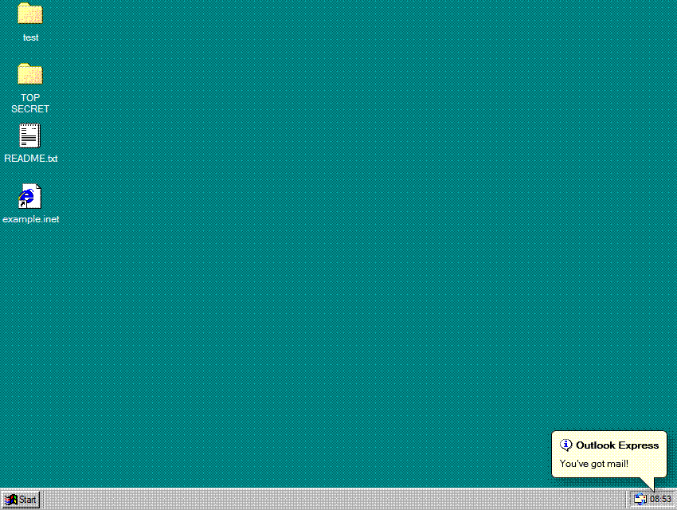

# Let Me In

## [▶️ PLAY NOW](https://nilllzz.github.io/letmein/)



The "Let Me In!" browser game is a game all about signing up to (imaginary) web pages using an interactive recreation of the Windows 98 desktop.

## Running and building the project

After cloning, make sure yarn and node are installed and usable on your system.

On first open, run this command in the root of the repository:

```bash
# Install all packages from `package.json`.
yarn
```

To then start the game on your system, run:

```bash
# Serve a live version of the game to localhost
yarn serve
```

This will host the game on your system. To access, copy `https://localhost:8080` into your browser and press enter. As the game runs on port 8080, that port is required to not be used by any other software.

To build a static version of the game to be deployed to a server, run:

```bash
yarn build
```

This will create a `dist` folder in the root of the project. Its contents can be shared as a static website.
